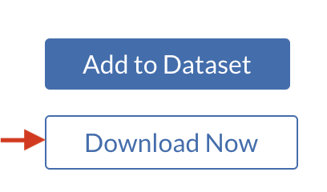
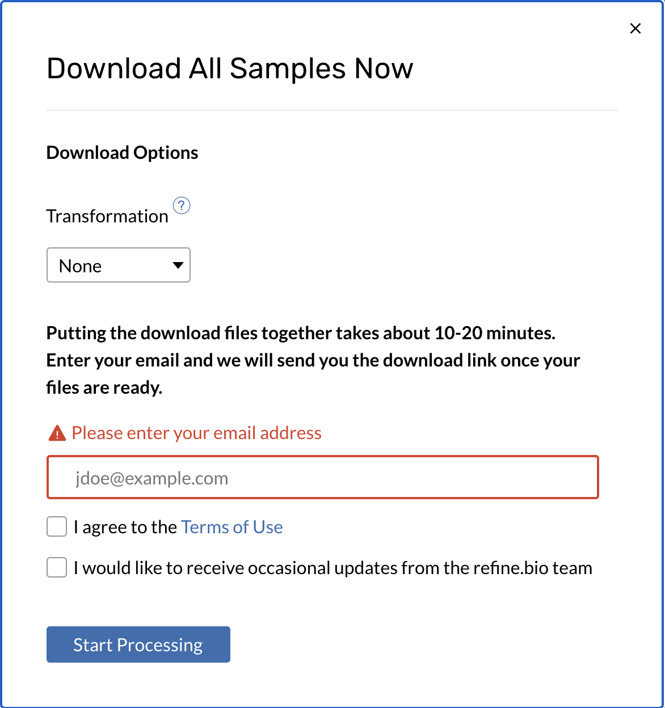
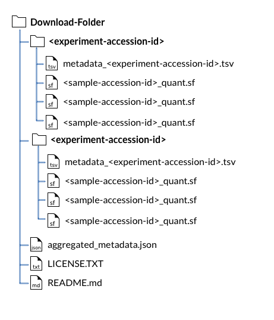
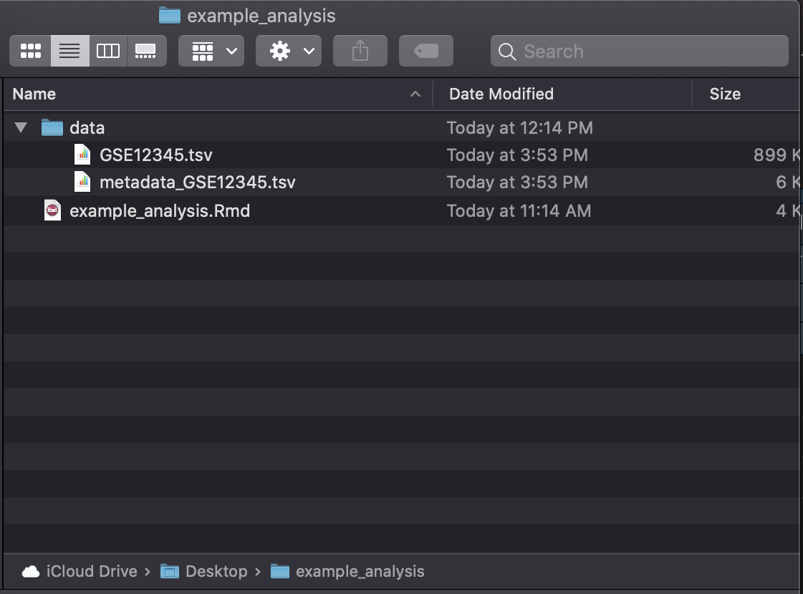

## Purpose of the analysis:

Clustering can help you investigate which samples (or genes) are more related to each other.
Here we use the Bioconductor R package `ComplexHeatmap` for clustering and creating a heatmap.
In this example, the gene expression matrix is subset to only include genes with high variance.
This set of genes is then used to create a heatmap.

## Further learning resources about this analysis
 - [Clustering strategies](https://www.statsandr.com/blog/clustering-analysis-k-means-and-hierarchical-clustering-by-hand-and-in-r/)
 - [Complex Heatmap book](https://jokergoo.github.io/ComplexHeatmap-reference/book/)
 - [Complex Heatmap vignette](https://bioconductor.riken.jp/packages/3.4/bioc/vignettes/ComplexHeatmap/inst/doc/s1.introduction.html)
 - [Complex Heatmap publication](https://academic.oup.com/bioinformatics/article/32/18/2847/1743594)
## How to run this example

### About dataset we are using for this example

For this example analysis, we will use this [zebrafish microarray dataset](
https://www.refine.bio/experiments/GSE12955/gene-expression-profile-of-zebrafish-kidney-side-population-sp-cells)
This dataset has two experimental groups of lymphoid cells from zebrafish kidney.
Using Hoechst fluorescence intensity, these were subdivided into the SP and MP populations. 

### Obtaining the dataset from refinebio

Go to this [dataset's page on refinebio](https://www.refine.bio/experiments/GSE12955/gene-expression-profile-of-zebrafish-kidney-side-population-sp-cells).

Click the "Download Now" button on the right side of this screen.



Fill out the pop up window with your email and our Terms and Conditions: 



This will download a zip file that has a name with a series of letters and numbers and ends in `.zip`. 
Double clicking should unzip this for you and create a folder of the same name. 


For more details on the contents of this folder see [these docs on refinebio](http://docs.refine.bio/en/latest/main_text.html#rna-seq-sample-compendium-download-folder). 

The `<experiment_accession_id>` folder has the data and metadata TSV files you will need for this example analysis.
Experiment accession ids usually look something like `GSE1235` or `SRP12345`. 

#### Obtaining this example R notebook

To run the examples yourself, you need to [download the Rmd by clicking this link](https://alexslemonade.github.io/refinebio-examples/02-microarray/clustering/clustering_example.Rmd). 
Clicking this link will most likely send this to your downloads folder on your computer. 

#### Set up your analysis folder

Before running the example analysis, we recommend setting up a new folder to hold all your analysis files.
In this folder you should create another folder called "data". 

*Your new analysis folder should contain:* 
- The example analysis Rmd you downloaded
- A folder called "data" which contains:
     - The gene expression
     - The metadata TSV 

Your example analysis folder should look something like this (except with respective experiment accession id and analysis notebook name you are using): 



#### Running the example analysis

You can open the example analysis notebook by opening this `.Rmd` file in RStudio.
Note that working with R Notebooks requires certain R packages, but RStudio should prompt you to download them the first time you open one.
This will allow you to modify and run the R code chunks.
Chunks that have already been included in an example can be run by clicking the green play button in the top right corner of the chunk or by using **Ctrl + Shift + Enter** (**Cmd + Shift + Enter** on a Mac).
See [this guide using to R Notebooks](https://bookdown.org/yihui/rmarkdown/notebook.html#using-notebooks) for more information about inserting and executing code chunks.

#### Using your own data

If you'd like to adapt an example analysis to use a different dataset from [refine.bio](https://www.refine.bio/), we recommend placing the files in the `data/` directory you created and changing the filenames and paths in the notebook to match these files (we've put comments to signify where you would need to change the code).
We suggest saving plots and results to `plots/` and `results/` directories, respectively, as these are automatically created by the notebook.
From here you can customize this analysis example to fit your own scientific questions and preferences. 

# Example clustering analysis 

## 1) Install libraries

```{r Install and attach the ComplexHeatmap library}
if (!("ComplexHeatmap" %in% installed.packages())) {
  # Install ComplexHeatmap
  BiocManager::install("ComplexHeatmap", update = FALSE)
}
```

Attach the `ComplexHeatmap` library:

```{r}
# Attach the library
library(ComplexHeatmap)

# Magrittr pipe
`%>%` <- dplyr::`%>%`

# Set the seed so our results are reproducible:
set.seed(12345)
```

Create output folder.

```{r}
# Create the plots folder if it doesn't exist
if (!dir.exists("plots")) {
  dir.create("plots")
}
```

## 2) Import and set up data
Data downloaded from refine.bio include a metadata tab separated values ("tsv")
file and a data tsv file. This chunk of code will read the both tsv files and 
add them as data.frames to your environment.

```{r Import data from .tsv files}
# Read in metadata tsv file
metadata <- readr::read_tsv(file.path("data", "metadata_GSE12955.tsv"))

# Read in data tsv file
df <- readr::read_tsv(file.path("data", "GSE12955.tsv")) %>%
  tibble::column_to_rownames('Gene')
```

Let's ensure that the metadata and data are in the same sample order. 

```{r}
# Make the data in the order of the metadata
df <- df %>% dplyr::select(metadata$geo_accession)

# Check if this is in the same order
all.equal(colnames(df), metadata$geo_accession)
```

## 3) Choose genes of interest
Although you may want to create a heatmap including all of the genes in the set,
alternatively, the heatmap could be created using only genes of interest. 
For this example, we will sort genes by variance, but there are many alternative
criterion by which you may want to sort your genes <i>eg</i> fold change,
t-statistic, membership to a particular gene ontology, so on. 

```{r Choose genes}
# Calculate the variance for each gene
variances <- apply(df, 1, var)

# Determine summary statistics for gene variances
sum.stats.var <- summary(variances)

# Subset the data choosing only genes whose variances are in the upper quartile
df.by.var <- df[which(variances > sum.stats.var[5]), ]
```

## 4) Create a heatmap
To further customize the heatmap, see the vignettes on Bioconductor for a guide 
at this [link](https://bioconductor.org/packages/devel/bioc/vignettes/ComplexHeatmap/inst/doc/s1.introduction.html).

```{r Create a heatmap}
# Reference the ComplexHeatmap guide for further customizing your heatmap
browseVignettes("ComplexHeatmap")

# Create an annotation that labels samples' groups by color
annot <- HeatmapAnnotation(df = data.frame(Groups = rep(c("SP", "MP"), each = 2)),
    col = list(Groups = c("SP" = "green", "MP" = "orange")))

# Create the heatmap object
heatmap <- Heatmap(df.by.var, 
        name = "Gene_Expression",
        show_row_names = FALSE,
        show_row_dend = FALSE,   # Can show the gene/row cluster if this is 
        #changed to TRUE
        column_dend_height = unit(4, "cm"),
        bottom_annotation = annot) # assign the previously made annotation object

# Print out the heatmap
heatmap
```

## 5) Save heatmap as a png
You can easily switch this to save to a jpeg or tiff by changing the function 
and file name within the function to the respective file suffix.

```{r Save heatmap as a png}
# Open a png file
png(file.path("plots", "HeatmapGSE12955.png"))

# Print your heatmap
heatmap

# Close the png file:
dev.off()
```

Print session info:

```{r Print session info}
# Print session info 
sessionInfo()
```
