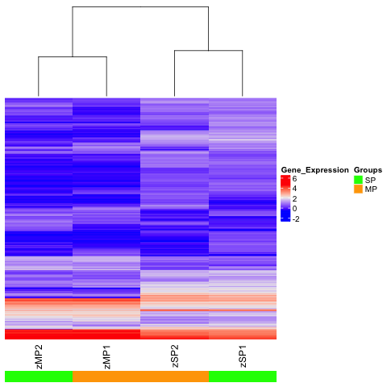

*Purpose*: This notebook illustrates one way that you can use harmonized data 
from refine.bio in downstream analyses.

## 1) Install libraries
This script uses the bioconductor R package ComplexHeatmap for clustering and 
creating a heatmap.
<br/> <i> Citation:</i> Gu Z, Eils R, Schlesner M (2016). “Complex heatmaps 
reveal patterns and correlations in multidimensional genomic data.” Bioinformatics.

```{r Install and attach the ComplexHeatmap library}
# Install the ComplexHeatmap package from bioconductor
source("https://bioconductor.org/biocLite.R")
biocLite("ComplexHeatmap", suppressUpdates = TRUE)

# Attach the library
library(ComplexHeatmap)
```

## 2) Import and set up data
Data downloaded from refine.bio include a metadata tab separated values ("tsv")
file and a data tsv file. This chunk of code will read the both tsv files and 
add them as data.frames to your environment.

```{r Import data from .tsv files}
# Read in metadata tsv file
metadata <- read.delim("../data/GSE12955_metadata.tsv", header=TRUE, 
                       stringsAsFactors = FALSE)

# Read in data tsv file
df <- read.delim("../data/GSE12955.tsv", header=TRUE, row.names= 1, 
                 stringsAsFactors = FALSE)
```

## 3) Choose genes of interest
Although you may want to create a heatmap including all of the genes in the set,
alternatively, the heatmap could be created using only genes of interest. 
For this example, we will sort genes by variance, but there are many alternative
criterion by which you may want to sort your genes <i>eg</i> fold change,
t-statistic, membership to a particular gene ontology, so on. 

```{r Choose genes}
# Calculate the variance for each gene
variances <- apply(df, 1, var)

# Determine summary statistics for gene variances
sum.stats.var <- summary(variances)

# Subset the data choosing only genes whose variances are in the upper quartile
df.by.var <- df[which(variances > sum.stats.var[5]), ]
```

## 4) Create a heatmap
To further customize the heatmap, see the vignettes on Bioconductor for a guide 
at this
<a href="https://bioconductor.org/packages/devel/bioc/vignettes/ComplexHeatmap/inst/doc/s1.introduction.html"> 
link. </a>

```{r Create a heatmap}
# Reference the ComplexHeatmap guide for further customizing your heatmap
browseVignettes("ComplexHeatmap")

# Create an annotation that labels samples' groups by color
annot <- HeatmapAnnotation(df = data.frame(Groups = rep(c("SP", "MP"), each = 2)),
    col = list(Groups = c("SP" = "green", "MP" = "orange")))

# Create the heatmap object
heatmap <- Heatmap(df.by.var, 
        name = "Gene_Expression",
        show_row_names = FALSE,
        show_row_dend = FALSE,   # Can show the gene/row cluster if this is 
        #changed to TRUE
        column_dend_height = unit(4, "cm"),
        bottom_annotation = annot) # assign the previously made annotation object
```
<center>

</center>

## 5) Save heatmap as a png
You can easily switch this to save to a jpeg or tiff by changing the function 
and filename within the function to the respective file suffix.

```{r Save heatmap as a png}
# Open a png file
png("HeatmapGSE12955.png")

# Print your heatmap
heatmap

# Close the png file:
dev.off()
```

```{r Print session info}
# Print session info 
sessionInfo()
```
