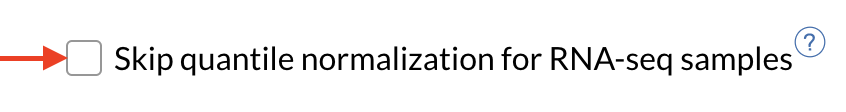
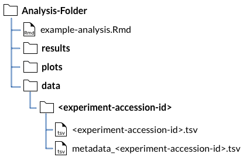

# Purpose of the analysis:

<!--WHAT DOES THIS ANALYSIS DO AND WHEN WOULD YOU USE IT?-->

# How to run this example

For general information about our tutorials, and for the basic software packages you will need; see our ['Getting Started' section](https://alexslemonade.github.io/refinebio-examples/01-getting-started/getting-started.html#how-this-tutorial-is-structured).
We recommend taking a look at our [Resources for Learning R](https://alexslemonade.github.io/refinebio-examples/01-getting-started/getting-started.html#resources-for-learning-r) if you have not written code in R before. 

## Obtain the `.Rmd` file of this analysis

To run this example yourself, [download the `.Rmd` for this analysis by clicking this link](https://alexslemonade.github.io/refinebio-examples/ {{RELATIVE PATH TO THIS ANALYSIS FROM REFINEBIO-EXAMPLES}}).

You can open this `.Rmd` file in RStudio and follow the rest of these steps from there (See our [section about getting started with R notebooks](https://alexslemonade.github.io/refinebio-examples/01-getting-started/getting-started.html#how-to-get-and-use-rmds) if you are unfamiliar with `.Rmd` files).
Clicking this link will most likely send this to your downloads folder on your computer. 
Move this `.Rmd` file to where you would like this example and its files to be stored.

## Set up your analysis folders 

Good file organization is helpful for keeping your data analysis project on track!
We have set up some code that will automatically set up a folder structure for you. 
Run this next chunk to set up your folders! 

If you have trouble running this chunk, see our [introduction to using Rmds](https://alexslemonade.github.io/refinebio-examples/01-getting-started/getting-started.html#how-to-get-and-use-rmds) for more resources and explanations. 

```{r}
# Define the file path to the data directory
data_dir <- file.path("data", {{experiment_accession}}) # Replace with path to desired data directory

# Create the data folder if it doesn't exist
if (!dir.exists(data_dir)) {
  dir.create(data_dir)
}

# Define the file path to the plots directory
plots_dir <- "plots" # Can replace with path to desired output plots directory

# Create the plots folder if it doesn't exist
if (!dir.exists(plots_dir)) {
  dir.create(plots_dir)
}

# Define the file path to the results directory
results_dir <- "results" # Can replace with path to desired output results directory

# Create the results folder if it doesn't exist
if (!dir.exists(results_dir)) {
  dir.create(results_dir)
}
```

In the same place you put this `.Rmd` file, you should now have three new empty folders called `data`, `plots`, and `results`!

## Obtain the dataset from refine.bio

For general information about downloading data for these examples, see our ['Getting Started' section](https://alexslemonade.github.io/refinebio-examples/01-getting-started/getting-started.html#how-to-get-the-data). 

Go to this [dataset's page on refine.bio]({{REFINEBIO DATASET PAGE LINK}}).

Click the "Download Now" button on the right side of this screen.  

  

Fill out the pop up window with your email and our Terms and Conditions:  

  

<!--DELETE THIS SECTION IF YOU DO WANT QUANTILE NORMALIZED DATA--> 

{{DELETE THIS LINE}}
We are going to use non-quantile normalized data for this analysis.
To get this data, you will need to check the box that says "Skip quantile normalization for RNA-seq samples".
Note that this option will only be available for RNA-seq datasets.


{{DELETE THIS LINE}}

It may take a few minutes for the dataset to process.
You will get an email when it is ready. 

## About the dataset we are using for this example

For this example analysis, we will use this [{{BRIEF DATASET NAME}}]({{REFINEBIO DATASET PAGE LINK}})..

<!--BRIEFLY SUMMARIZE THIS DATASET--> 

## Place the dataset in your new `data/` folder

Refine.bio will send you a download button in the email when it is ready. 
Follow the prompt to download a zip file that has a name with a series of letters and numbers and ends in `.zip`. 
Double clicking should unzip this for you and create a folder of the same name.  

 

For more details on the contents of this folder see [these docs on refine.bio](http://docs.refine.bio/en/latest/main_text.html#rna-seq-sample-compendium-download-folder).  

The `<experiment_accession_id>` folder has the data and metadata TSV files you will need for this example analysis.
Experiment accession ids usually look something like `GSE1235` or `SRP12345`. 

Copy and paste the `<experiment_accession_id>` folder into your newly created `data/` folder.

## Check out our file structure!

Your new analysis folder should contain: 

- The example analysis Rmd you downloaded  
- A folder called "data" which contains:
  - The `<experiment_accession_id>` folder which contains:
    - The gene expression  
    - The metadata TSV  

Your example analysis folder should now look something like this (except with respective experiment accession id and analysis notebook name you are using): 



In order for our example here to run without a hitch, we need these files to be in these locations so we've constructed a test to check before we get started with the analysis. 
Run this chunk to double check that your files are in the right place. 

```{r}
# Check if the gene expression matrix file is in the data directory stored as `data_dir`
file.exists(file.path(data_dir, {{DATA_ACCESSION FILENAME}}))

# Check if the metadata file is in the data directory stored as `data_dir`
file.exists(file.path(data_dir, {{METADATA_ACCESSION FILENAME}}))
```

If the chunk above printed out `FALSE` to either of those tests, you won't be able to run this analysis _as is_ until those files are in the appropriate place.

If the concept of a "file path" is unfamiliar to you; we recommend taking a look at our [section about file paths](https://alexslemonade.github.io/refinebio-examples/01-getting-started/getting-started.html#an-important-note-about-file-paths-and-Rmds). 

# Using a different refine.bio dataset with this analysis?

If you'd like to adapt an example analysis to use a different dataset from [refine.bio](https://www.refine.bio/), we recommend placing the files in the `data/` directory you created and changing the filenames and paths in the notebook to match these files (we've put comments to signify where you would need to change the code).
We suggest saving plots and results to `plots/` and `results/` directories, respectively, as these are automatically created by the notebook.
From here you can customize this analysis example to fit your own scientific questions and preferences. 

***

# {{NAME OF example}}

## Install libraries

See our getting started with [package installation](https://alexslemonade.github.io/refinebio-examples/01-getting-started/getting-started.html#what-you-need-to-install) for a list of the other software you will need, as well as more tips and resources. 

In this analysis, we will be using {{PACKAGE}} [{{CITATION}}].

```{r}
if (!({{PACKAGE}} %in% installed.packages())) {
  # Install this package if it isn't installed yet
  BiocManager::install({{PACKAGE}}, update = FALSE)
}
```

Attach the {{PACKAGE}}:

```{r}
# Attach the library
library({{PACKAGE}})

# We will need this so we can use the pipe: %>%
library(magrittr)

{{SET THE SEED IF YOU NEED}}
```

## Import and set up data

Data downloaded from refine.bio include a metadata tab separated values (TSV) file and a data TSV file. 
This chunk of code will read the both TSV files and add them as data frames to your environment.

```{r}
# Read in metadata TSV file
metadata <- readr::read_tsv(file.path(data_dir, # Replace with path to your metadata file
                                      {{METADATA_ACCESSION FILENAME}} # Replace with the name of your metadata file
                                      ))

# Read in data TSV file
df <- readr::read_tsv(file.path(data_dir, # Replace with path to your data file
                                {{DATA_ACCESSION FILENAME}} # Replace with the name of your data file
                                )) %>%
  tibble::column_to_rownames('Gene')
```

Let's ensure that the metadata and data are in the same sample order. 

```{r}
# Make the data in the order of the metadata
df <- df %>% dplyr::select(metadata$geo_accession)

# Check if this is in the same order
all.equal(colnames(df), metadata$geo_accession)
```


<!--ALL THE ANALYSIS STEPS HERE -->


# Further learning resources about this analysis

- [{{HELPFUL RESOURCE NAME}}]({{LINK TO HELPFUL RESOURCE}}) [{{CITATION}}]

# Print session info:

At the end of every analysis, before saving your notebook, we recommend printing out your session info. 
This helps make your code more reproducible by recording what versions of softwares and packages you used to run this. 

```{r}
# Print session info 
sessionInfo()
```
